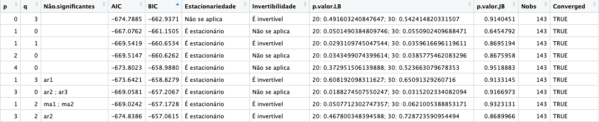
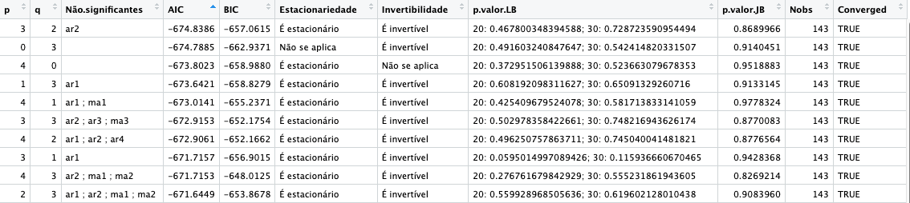

```{r setup, include=FALSE}
knitr::opts_chunk$set(echo = TRUE)
```

## Parte 1

### Questão 1

**Michaillat e Saez (2022) propõem uma medida da taxa de desemprego
eficiente de uma economia. Qual é essa medida? Qual é sua interpretação?
Explique a derivação da fórmula por eles obtida.**

Michaillat e Saez (2022) propõem uma nova abordagem para calcular a
**taxa de desemprego eficiente** em uma economia, definida como a taxa
que minimiza o desperdício de trabalho, equilibrando o número de
desempregados e as vagas disponíveis.

1.  **A Medida da Taxa de Desemprego Eficiente**

A fórmula proposta para a **taxa de desemprego eficiente** é a seguinte:

$$ u^* = \sqrt{u \times v} $$

onde: - $u^*$ é a taxa de desemprego eficiente, - $u$ é a taxa de
desemprego observada, - $v$ é a taxa de vagas (ou o número de vagas em
aberto como uma fração da força de trabalho).

2.  **Interpretação da Medida**

A taxa de desemprego eficiente $u^*$ é interpretada como o ponto onde o
mercado de trabalho equilibra o excesso de desemprego e o excesso de
vagas. Essa taxa representa um nível de desemprego onde o custo social
das vagas não preenchidas é igual ao custo social do desemprego. Ela
destaca a necessidade de balancear o desemprego e as vagas para atingir
um nível eficiente de desemprego, oferecendo uma abordagem prática para
políticas de mercado de trabalho mais eficazes.

-   **Se** $u > u^*$: Há excesso de desemprego na economia, indicando
    que a oferta de trabalho é maior do que a demanda.
-   **Se** $u < u^*$: Há excesso de vagas na economia, significando que
    a demanda por trabalhadores é maior do que a oferta disponível.

3.  **Derivação da Fórmula**

A derivação da taxa de desemprego eficiente por Michaillat e Saez é
baseada na **curva de Beveridge**, que descreve a relação inversa entre
o desemprego e as vagas.\
A derivação matemática baseia-se na minimização do custo social total no
mercado de trabalho, levando à fórmula final que equilibra os custos de
desemprego e de vagas, definindo a **taxa de desemprego eficiente** como
a média geométrica entre as taxas de desemprego e de vagas.

Passos principais da derivação:

a.  **Curva de Beveridge:**

A curva de Beveridge é uma relação empírica observada entre a taxa de
desemprego e a taxa de vagas. Ela mostra que, em períodos de alta no
desemprego, a taxa de vagas tende a ser baixa, e vice-versa.

b.  **Minimização do Desperdício de Trabalho:**

A medida proposta minimiza o uso não produtivo do trabalho, representado
pelo somatório de duas partes:

O custo social total na economia é composto por:

-   **Custo do Desemprego:** Representa a perda de bem-estar associada a
    trabalhadores desempregados, denotado por $C_u$.
-   **Custo das Vagas em Aberto:** Representa a perda associada a vagas
    não preenchidas, denotado por $C_v$.

Assim, o custo social total é definido como:

$$ C = C_u + C_v $$

Assume-se que os custos individuais são proporcionais às taxas
observadas: - **Custo do Desemprego:** Proporcional à taxa de desemprego
$u$, ou seja, $C_u \propto u$. - **Custo das Vagas em Aberto:**
Proporcional à taxa de vagas $v$, ou seja, $C_v \propto v$.

Logo, o custo social total pode ser escrito como:

$$ C = A \cdot u + B \cdot v $$

onde $A$ e $B$ são constantes que representam a sensibilidade dos custos
ao desemprego e às vagas, respectivamente.

c.  **Função de Minimização:**

Eles formulam uma função de minimização que combina o custo do
desemprego com o custo de vagas em aberto. A condição de eficiência é
atingida quando a derivada dessa função com relação ao desemprego é
igual à derivada com relação às vagas.

Essa condição de equilíbrio resulta na fórmula
$u^* = \sqrt{u \times v}$, onde o custo marginal do desemprego é igual
ao custo marginal das vagas em aberto. A derivação da fórmula para a
**taxa de desemprego eficiente** em Michaillat e Saez (2022) é baseada
na minimização do custo social associado ao desemprego e às vagas em
aberto, usando como base a **curva de Beveridge**, que descreve a
relação inversa entre desemprego e vagas. Para encontrar a taxa de
desemprego eficiente, é necessário minimizar o custo social total. Isso
é feito diferenciando o custo social total com respeito a $u$, usando a
condição de que o custo social marginal de $u$ seja igual ao custo
social marginal de $v$:

$$
\frac{dC}{du} = \frac{dC}{dv}
$$

A condição de eficiência implica que o custo marginal de adicionar mais
um desempregado seja igual ao custo marginal de adicionar mais uma vaga
em aberto. Isso leva a:

$$
A = B \cdot \frac{dv}{du}
$$

Usando a relação inversa da curva de Beveridge, sabemos que:

$$
\frac{dv}{du} = -\frac{v}{u}
$$

Substituindo isso na equação anterior:

$$
A = -B \cdot \frac{v}{u}
$$

Rearranjando a expressão e resolvendo para a taxa de desemprego
eficiente $u^*$, obtemos:

$$
u^* = \sqrt{u \cdot v}
$$

Essa fórmula para a taxa de desemprego eficiente indica que ela é a
**média geométrica** das taxas de desemprego e de vagas. Ela representa
o ponto onde o custo social do desemprego e o custo das vagas em aberto
estão equilibrados, refletindo a alocação eficiente dos recursos no
mercado de trabalho.

## Parte 2

Faça o download da série de vagas não preenchidas no mercado de trabalho
alemão (link), além dos dados de desemprego e população economicamente
ativa (link), de janeiro de 1991 a dezembro de 2023, com ajuste sazonal.

```{r}
library(readxl)
library(dplyr)
pop_ec_ativa <- read_xlsx("pop_ec_ativa.xlsx")
Link1_M <- read.csv("link1.csv")
```

### Questão 2

**Construa a série de taxa de vacância (postos não preenchidos como
percentual da população economicamente ativa). Há evidência de não
estacionariedade na série? De quais tipos? Justifique.**

Queremos selecionar as linhas de população economicamente ativa só até
dezembro de 2023

```{r}
pop_ec_ativa <- pop_ec_ativa[1:397,]
```

Mudar os nomes das colunas de interesse para facilitar a manipulação.

```{r}
names(pop_ec_ativa)[names(pop_ec_ativa) == "X13 JDemetra+  Trend...7"] <- "populacao_ativa"
names(Link1_M)[names(Link1_M) == "OBS_VALUE"] <- "vagas_livres"
names(pop_ec_ativa)[names(pop_ec_ativa) == "X13 JDemetra+  Trend...10"] <- "desemprego_obs"
```

Transformar ambas as colunas em que estamos interessados em valores
numéricos.

```{r}
Link1_M$vagas_livres <- as.numeric(Link1_M$vagas_livres)
pop_ec_ativa$populacao_ativa <- as.numeric(pop_ec_ativa$populacao_ativa)
pop_ec_ativa$desemprego_obs <- as.numeric(pop_ec_ativa$desemprego_obs)
```

Remover a primeira coluna em pop_ec_ativa que não eram dados.

```{r}
pop_ec_ativa <- pop_ec_ativa[!is.na(pop_ec_ativa$populacao_ativa),]
```

Multiplicou-se os dados de população economicamente ativas por 1000000
para corresponder ao total de pessoas.

```{r}
pop_ec_ativa$populacao_ativa <- pop_ec_ativa$populacao_ativa*1000000
```

Próximo passo é criar a Série temporal de taxa de vacância desde 1991.
Antes é necessário ordenar a série de vagas abertas, pois alguns dados
estão fora de ordem cronológica. A taxa de vacância é esta série
dividida pela população economicamente ativa (em forma de porcentagem).

```{r}
Link1_M <- Link1_M %>% arrange(TIME_PERIOD)
taxa_vacancia <- ts(100*Link1_M$vagas_livres/pop_ec_ativa$populacao_ativa, start = c(1991, 1), frequency = 12)
```

Plotando a série para observação:

```{r}
plot(taxa_vacancia, main ="Taxa de Vacância", xlab = "Anos", 
     ylab = "Porcentagem", col = "blue", lwd = 2, yaxt = "n")
yticks <- axTicks(2)
axis(2, at = yticks, labels = paste0(yticks, "%"))
text(x = 2000, y = 1.6, labels = "Mercado de trabalho alemão")
text(x = 2000, y = 1.4, labels = "1991-2013")
text(x = 2009, y = 1.9, labels = "Vagas / População ativa")
```

Importar bibliotecas necessárias para fazer os testes de tendência

```{r}
library("CADFtest") # testes de raiz unitária
library("sandwich") #Erros padrão HAC
library("lmtest") #Teste robusto
library("car") #Teste de restrições lineares
library("forecast") #Previsões
```

Há evidencia de não estacionariedade na série? de quais tipos?
Justifique.

Vamos utilizar os testes de Dick-Fuller aumentado para verificar a
existência de raízes unitárias (não estacionaridade). Inicialmente
realizamos o teste para o modelo completo (com tendência e intercepto).

```{r}
teste_linear = CADFtest(taxa_vacancia, type = "trend", max.lag.y = ceiling(12*(length(taxa_vacancia)/100)^(1/4)),
                 criterion = "MAIC")
print(teste_linear)
```

Como o p-valor é 0.4078 \> 0.10 (10% de significância estipulada) não
rejeitamos a hipótese nula de que não há raiz unitária.

Passamos ao teste de tendência linear.

```{r}
print(teste_linear$est.model)
linearHypothesis(teste_linear$est.model,c("trnd = 0", "L(y, 1) = 0" ))
```

Como o teste F é 2.89, menor que 5,36 (teste F para amostra com 500
dados e nível de significância de 10%) não rejeitamos que os parâmetros
associados a raiz e à tendência possam ser 0.

Checamos então a raiz unitária para o modelo com intercepto e sem
tendência.

```{r}
teste_intercepto = CADFtest(taxa_vacancia, type = "drift", max.lag.y = ceiling(12*(length(taxa_vacancia)/100)^(1/4)), 
                 criterion = "MAIC")
teste_intercepto
```

Como o p-valor é 0.7943 \> 0.10 não rejeitamos a hipotese nula. 

Vamos continuar e conduzir o teste F para detectar se o modelo de fato
apresenta intercepto.

```{r}
print(teste_intercepto$est.model)
linearHypothesis(teste_intercepto$est.model,c("(Intercept) = 0", "L(y, 1) = 0" ))
```

Como o teste F é 0.9152, menor que 3,79 (teste F para amostra com 500
dados e nível de significância de 10%) não rejeitamos que o parâmetro
alpha associado ao intercepto possa ser 0.

O intercepto e o coeficiente associado a $y_{t-1}$ são ambos zero. Nesse
caso, vamos para o modelo sem componentes determinísticos.

```{r}
teste = CADFtest(taxa_vacancia, type = "none", max.lag.y = ceiling(12*(length(taxa_vacancia)/100)^(1/4)), 
                 criterion = "MAIC")
print(teste)
```

Como o p-valor é 0.8609 \> 0.10 não rejeitamos a hipotese nula de que
não tem raiz unitária. Logo, nosso modelo tem uma raiz unitária

Vamos testar a presença de componentes determinísticos. Como os dados
apresentam tendência estocástica (raiz unitária), trabalharemos com a
série diferenciada.

Plotando a série em primeira diferença:

```{r}
plot(diff(taxa_vacancia), main ="Taxa de Vacância (primeira diferença)", 
     xlab = "Anos", ylab = "Valor", col = "blue", lwd = 1)
```

Visualmente parece não haver tendências.

```{r}
 trend = 1:(length(taxa_vacancia)-1)
modelo = lm(diff(taxa_vacancia)~trend)
coeftest(modelo, vcov. = vcovHAC)
```

Fazendo um teste de regresão obtemos p valores altos e estimativas para
a variável associada à tendência e ao intercepto bem baixas, o que não
nos leva a concluir muita coisa, mas não podemos rejeitar a hipótese
nula de que não há tendência linear determinística na série em primeira
diferença.

### Questão 3

**. Construa a medida de desemprego eficiente de Michaillat e Saez
(2022). Há evidência de não estacionariedade na série? De quais tipos?
Justifique.**

Como explicado na questão 1 a medida de desemprego eficiente é dada por

:   $$u^* = \sqrt(u \cdot v)$$

Em que $u$ é a taxa de desemprego observada e $v$ é a taxa de vagas
livres, que são representadas por `pop_ec_ativa$desemprego_obs` e pela
série temporal, taxa_vacancia, criada na Questão 2, respectivamente.
Vamos então criar uma uma série temporal com essas duas colunas

Criando a série taxa de desemprego eficiente desde 1991.

```{r}
taxa_desemprego <- ts(pop_ec_ativa$desemprego_obs, start = c(1991, 1), frequency = 12)
desemprego_eficiente <- sqrt(taxa_desemprego*taxa_vacancia)
```

Plotando a série:

```{r}
plot(desemprego_eficiente, main ="Taxa de desemprego eficiente", ylim = c(1.8, 3.2),
     xlab = "Anos", ylab = "Taxa", yaxt = "n", col = "purple", lwd = 2)
yticks <- axTicks(2)
axis(2, at = yticks, labels = paste0(yticks, "%"))
```

Criando a série desempregados e plotando as taxas envolvidas.

```{r}
desempregados <- ts(pop_ec_ativa$desemprego_obs, start = c(1991, 1), frequency = 12)
plot(desempregados, main ="Taxas", cex.main = 1, xlab = "Anos", ylim = c(0, 12),ylab = "Porcentagem", col = "red", lwd = 2, yaxt = "n", axes = TRUE)
yticks <- axTicks(2)
axis(2, at = yticks, labels = paste0(yticks, "%"))
lines (taxa_vacancia, col = "blue", lwd = 2)
lines (desemprego_eficiente, col = "purple", lwd = 2)
text(x = 2018, y = 5.9, labels = "Taxa de Desemprego")
text(x = 2000, y = 3.8, labels = "Taxa de Eficiência")
text(x = 2015, y = 0.4, labels = "Taxa de Vacância")
```

 Vamos repetir todo processo da questão 2 para verificar a
estacionariedade da série

```{r}
teste_linear = CADFtest(desemprego_eficiente, type = "trend", max.lag.y = ceiling(12*(length(desemprego_eficiente)/100)^(1/4)),
                 criterion = "MAIC")
print(teste_linear)
```

Como o p-valor é 0.227 \> 0.10 não rejeitamos a hipotese nula de que não
tem raiz unitária

Vamos verificar se tem tendência linear:

```{r}
print(teste_linear$est.model)
linearHypothesis(teste_linear$est.model,c("trnd = 0", "L(y, 1) = 0" ))
```

Como o teste F é 3.9991 \< 5.36 não rejeitamos que o parâmetro beta
possa ser 0.

Checando raiz unitária para o modelo com intercepto

```{r}
teste_intercepto = CADFtest(desemprego_eficiente, type = "drift", max.lag.y = ceiling(12*(length(desemprego_eficiente)/100)^(1/4)), 
                 criterion = "MAIC")
print(teste_intercepto)
```

p-valor é 0.1618 \> 0.10 não rejeitamos a hipotese nula de que não tem
raiz unitária. 

Vamos conduzir o teste F para detectar se o modelo de fato apresenta
intercepto.

```{r}
print(teste_intercepto$est.model)
linearHypothesis(teste_intercepto$est.model,c("(Intercept) = 0", "L(y, 1) = 0" ))
```

Como o teste F é 2.7293 \< 3.79, não rejeitamos que o parâmetro alpha
possa ser 0.

Não rejeitamos que o intercepto e o coeficiente associado a $y_{t-1}$
são ambos zero. Nesse caso, vamos para o modelo sem componentes
determinísticos.

```{r}
teste = CADFtest(desemprego_eficiente, type = "none", max.lag.y = ceiling(12*(length(desemprego_eficiente)/100)^(1/4)), 
                 criterion = "MAIC")
print(teste)
```

Como o p-valor é 0.6339 \> 0.10 não rejeitamos a hipotese nula de que
não tem raiz unitária. Logo, nosso modelo tem uma raiz unitária.

```{r}
 trend = 1:(length(desemprego_eficiente)-1)
modelo = lm(diff(desemprego_eficiente)~trend)
coeftest(modelo, vcov. = vcovHAC)
```

Fazendo um teste de regresão e novamente obtemos p valores altos e
estimativas para a variável associada à tendência e ao intercepto bem
baixas. Não podemos rejeitar a hipótese nula de que não há tendência
linear determinística na série em primeira diferença.

### Questão 4

No artigo de Bradley e Kügler, eles descrevem como ocorreram as reformas
no mercado de trabalho na Alemanha no início do século XXI. Essas
reformas tinham o objetivo principal de diminuir o desemprego na
Alemanha e consistiam em quatro leis que foram implementadas anualmente,
começando com as duas primeiras em janeiro de 2003. As primeiras leis
implementadas em 2003 facilitavam a contratação de trabalhadores
temporários. Em 2004, a terceira lei reestruturou a Agência Federal de
Emprego para facilitar a alocação de uma pessoa para determinado
emprego. Por último, em 2005, a quarta lei implementada penalizava
pessoas desempregadas que recusassem o emprego que lhes fosse oferecido,
impondo sanções, além de oferecer menos apoio conforme o tempo de
desemprego aumentava. Todas essas leis têm em comum o objetivo de
diminuir o número de desempregados, tanto por meio de facilitar a
contratação, como ocorre nas três primeiras leis, quanto pressionando o
cidadão a aceitar um emprego, como é o caso da última.

Em ambos os casos, essas leis impactam diretamente a dinâmica entre a
oferta e a demanda de trabalho, neste caso diminuindo o desemprego. Como
o índice de desemprego eficiente sugerido por Michaillat e Saez é dado
pela raiz do produto entre a taxa de vacância e o número de pessoas
desempregadas, é natural esperar que as reformas tenham influência
direta sobre a medida de desemprego eficiente.

### Questão 5

A questão solicita que se selecione os dados da série construída para a
taxa de eficiência de desemprego até dezembro de 2002. Foi utilizada a
função window na série. A questão pede para aplicarmos o modelo (S)ARIMA
na série de desemprego, porém como já estamos utilizando a base de dados
dessazonalizada, a sazonalidade já foi retirada. Portanto, não é
necessário aplicar o modelo SARIMA, apenas o ARIMA.

```{r}
desemprego_eficiente_wd <- window(desemprego_eficiente, end = c(2002, 12))
# GRÁFICO DA TAXA APENAS ILUSTRATIVO
plot(desemprego_eficiente_wd, main ="Taxa de desemprego eficiente", ylim = c(1.8, 3.2),
     xlab = "Anos", ylab = "Taxa", yaxt = "n", col = "purple", lwd = 2)
yticks <- axTicks(2)
axis(2, at = yticks, labels = paste0(yticks, "%"))
text(x = 2000, y = 2, labels = "Até 2002")
```

Série em primeira diferença:

```{r}
plot(diff(desemprego_eficiente_wd), main ="Taxa de desemprego eficiente primeira diferença",
     xlab = "Anos", ylab = "Taxa", yaxt = "n", col = "purple", lwd = 2)
yticks <- axTicks(2)
axis(2, at = yticks, labels = paste0(yticks, "%"))
```

Série parece não apresentar componentes determinísticos na primeira
diferença. Dessa forma, estima-se o ARMA em primeira diferença
(ARIMA(p,1,q)) sem intercepto ou tendência.

Visualização do FAC e FACP para estimar o processo. (FAC e FACP do
processo estacionarizado na primeira diferença).

```{r}
acf(diff(desemprego_eficiente_wd), lag.max = 40, main = "FAC")
# SUGERE MA(3)
pacf(diff(desemprego_eficiente_wd), lag.max = 40, main = "FACP")
# SUGERE AR(4)
```

Vamos testar as opções com a função auxiliar "arima.est.parallel" e p
máximo igual a 4 e q máximo igual a 3. O fato das séries já possuirem ajuste sazonal na fonte nos assegura buscar um ajuste sem a necessidade de busca por sazonalidade.

```{r}
pmax = 4
qmax = 3

# Uso de função auxiliar (inclusão do arquivo box_jenkins_parallel.R)
source("box_jenkins_parallel.R")
tabela = arima.est.parallel(desemprego_eficiente_wd, pmax, qmax, d=1,
          include.constant = F, include.trend = F, signif = 0.05, lags.lbox = c(20,30))
#Removendo modelos que não convergiram
tabela = tabela[tabela$Converged,]
```

Para fazer a escolha dos parâmetros do modelo ARIMA, vamos ordenar a tabela de acordo com o critério de informação de Akaike (AIC) e de Bayes (BIC).
A tabela dos conjuntos dos parâmetros em ordem crescente ficará da seguinte maneira:


Enquanto que a tabela dos conjuntos dos parâmetros com o AIC em ordem crescente ficará:



Note que para o critério de informação de Akaike (AIC) o melhor modelo é o ARIMA(3,1,2) e para o critério de informação de Bayes (BIC) o melhor modelo é o ARIMA(0,1,3). Porém para o critério AIC o modelo ARIMA(0,1,3) ainda é o segundo melhor modelo, enquanto que para o critério BIC o modelo ARIMA(3,1,2) é o nono melhor modelo. Além disso, gostariamos que o nosso modelo fosse o mais parcimonioso possível que implica em escolher o modelo com menos parâmetros desnecessário, e note que a segunda defasagem no ARMA(3,1,2) é não significativa. Portanto, escolheremos o modelo ARIMA(0,1,3) como o melhor modelo para a série de desemprego eficiente.

```{r}
modelo = Arima(desemprego_eficiente_wd, order =c(0,1,3), include.constant = F, include.drift = F)
summary(modelo)
```

```{r}
checkresiduals(modelo)
```

O p-valor alto para o teste de Ljung-Box indica pouca correlação nos
erros, o que é desejável. O histograma dos resíduos não é exatamente uma normal mas se adequa de certa forma, o que também é um bom sinal. 

Tendo como base o modelo ARIMA, podemos testar previsões para a série.

```{r}
forecast(modelo)
```

Comparando a previsão com a série real.

```{r}
desemprego_eficiente_wd2 <- window(desemprego_eficiente, end = c(2006, 12))
plot(forecast(modelo,h=36), type="l", col="blue", lwd=2, xlab="Anos",
ylab="Taxa de Desemprego Eficiente", main = "Previsões para a taxa em 3 anos")
lines(desemprego_eficiente_wd2)
text(x = 2004, y = 2.83, labels = "     Previsão")
text(x = 2004, y = 2.2, labels = "SÉRIE REAL")
```

### Questão 6

Para estimar os efeitos das reformas de janeiro de 2003 a dezembro de 2006 teremos que comparar a série original e a série prevista a partir de dezembro de 2002 durante os próximos 48 meses. A série prevista (baseada no modelo ARIMA) ignora a existência de reformas e deverá manter-se fiel (dentro do erro) ao modelo original.

Criando séries com a previsão do modelo e valores mínimos e máximos para 95% de precisão 48 meses adiante após dezembro de 2002.

```{r}
previsao <- forecast(modelo,h=48)$mean
prev_min <- forecast(modelo,h=48)$lower[,2]
prev_max <- forecast(modelo,h=48)$upper[,2]
```


Criando janela da série original de desemprego eficiente para as datas de análise.

```{r}
desemprego_eficiente_wd2 <- window(desemprego_eficiente, start = c(2003,1), end = c(2006, 12))
```

Criando séries com diferença entre previsão e valores reais.

```{r}
dif_previsao <- desemprego_eficiente_wd2 - previsao
dif_prev_min <- desemprego_eficiente_wd2 - prev_min
dif_prev_max <- desemprego_eficiente_wd2 - prev_max
```

Plotando os resultados. Valores da série plotada acima da previsão é um indicativo de efeito positivo da reforma. Série abaixo da previsão, o contrário. Lembrando que a taxa de desemprego eficiente, dada a alta taxa de desemprego associada ao período, deve aumentar, puxando uma alta na taxa de vacância em busca do equilíbrio.
Percebe-se que os efeitos positivos da reforma podem estão mais nítidos após 2005.

```{r}
plot(dif_previsao, type="l", col="blue", lwd=2, xlab="Anos", ylim = c(-0.8, 0.8), ylab="Taxa de Desemprego Eficiente", main = "Diferença entre série e previsão")
lines(dif_prev_min )
lines(dif_prev_max)
abline(h = 0, col = "red", lwd = 2, lty = 2)
text(x = 2003.4, y = 0.55, labels = "2003 a 2006")
text(x = 2006.3, y = 0.12, cex =0.8,labels = "Série acima da previsão")
text(x = 2004.5, y = -0.2, cex =0.8,labels = "Série abaixo da previsão")
```


### Questão 7

Hipóteses de identificação para a validade da abordagem anterior em
recuperar os efeitos de interesse Análise de razoabilidade no contexto
da reforma e justificativas, preocupações com a identificação e
sugestões de modificações da abordagem/métodos alternativos que mitiguem
essas preocupações.

Existem duas hipóteses principais que devem ser satisfeitas para que a abordagem anterior seja válida. A primeira é que o resultado potencial não tratado segue um modelo (S)ARIMA, onde o termo de erro são as inovações.

A segunda é que o termo de inovação $ \epsilon_t $ (ruídos brancos) seja independente de $ T^* $, que é o momento em que a reforma foi realizada. Esta segunda hipótese implica que a decisão sobre quando realizar a reforma depende apenas de informações disponíveis antes da reforma e não de fatores que poderiam prever as inovações futuras da série. Ou seja, a reforma não pode ser feita em resposta a um choque na série que poderia influenciar a série no futuro. Note que, se a tomada de decisão da implementação tivesse sido feita com base no modelo de Box-Jenkins, isso não seria um problema, pois o modelo é feito com base em dados passados e não futuros.

Essas hipóteses não parecem muito razoáveis para o nosso caso. O principal problema está em garantir a segunda hipótese, pois é muito comum que reformas desse tipo sejam implementadas como uma forma de conter algo que se espera que aconteça no futuro e não em resposta a algo que já ocorreu. Antecipações de crises, por exemplo, são muito frequentes. Uma possível forma de mitigar essa preocupação seria não implementar a reforma em algumas regiões com tendências paralelas similares ao restante do país. Em seguida, aplicar o método de Diferenças em Diferenças, comparando o efeito da reforma nas cidades afetadas com o grupo que não foi afetado. Isso poderia ajudar a comparar o efeito que a reforma teve na série com um contrafactual que representaria o cenário em que a reforma não tivesse sido implementada.
